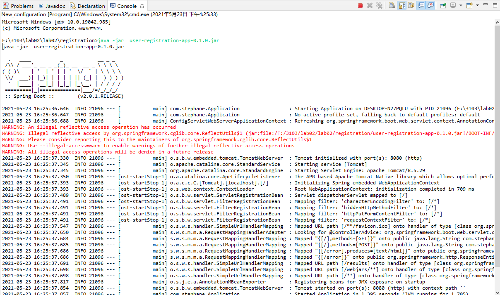
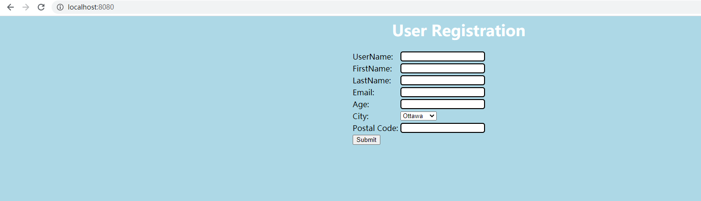
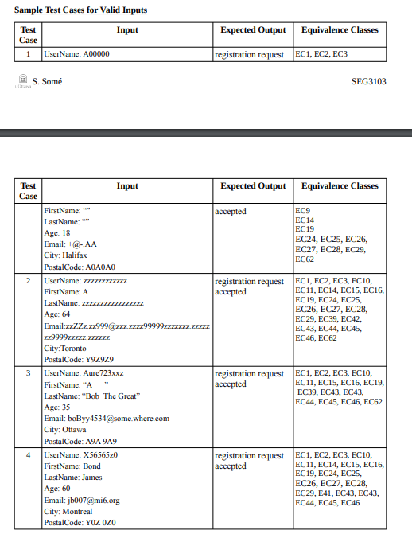
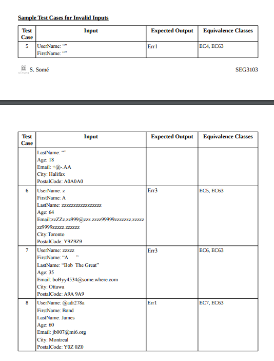
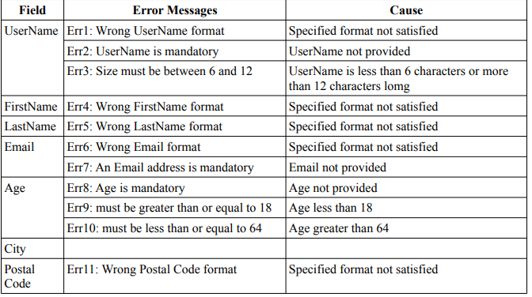
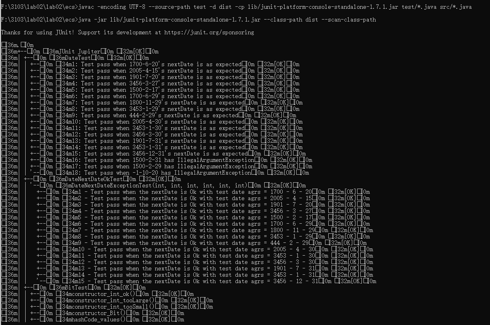
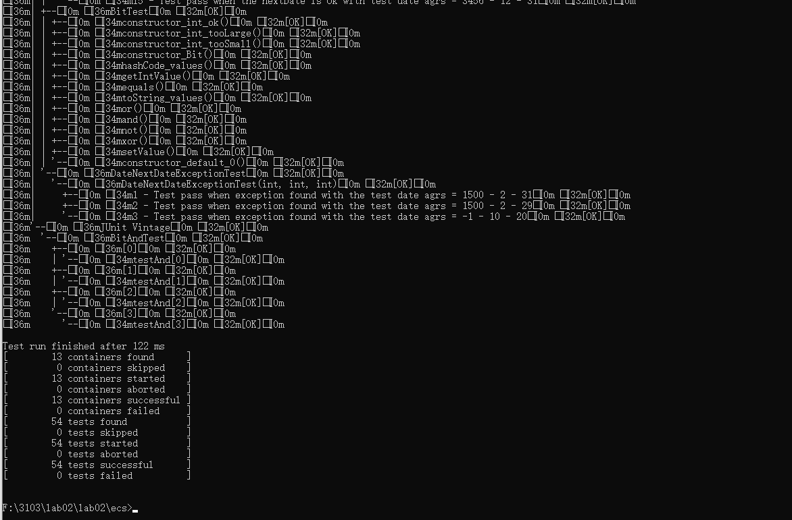

# SEG3103

| Outline | Value |
| --- | --- |
| Course | SEG 3103 |
| Date | Summer 2021 |
| Professor | Andrew Forward, aforward@uottawa.ca |
| TA | James Url, jamesurl@uottawa.caa |
| Team | Chuhao jia 8794959<br>Keng Li 7847075 |


## Deliverables

* [https://github.com/jiachuhao123/seg3103_playground/tree/main/lab02](https://github.com/jiachuhao123/seg3103_playground/tree/main/lab02)
* Shared repo above with TA and Professors

### System

Windows 10

### Java

I am running Java openjdk 16

```bash
java --version
java 16.0.1 2021-04-20
Java(TM) SE Runtime Environment (build 16.0.1+9-24)
Java HotSpot(TM) 64-Bit Server VM (build 16.0.1+9-24, mixed mode, sharing)
```


### Exercise1

To run the 'user-registration-app-0.1.0.jar' (in `registration`), run the follwing command in regirstration folder
```bash
java -jar  user-registration-app-0.1.0.jar
```


Then copy http://localhost:8080/ to your browser and login it. You should see the page like this:



We then use the sample test cases given in Tutorials to do the test, the sample test cases are




The error type codes are




The test results are shown in the follow table
| Test Case | Expected Results | Actual Results | Verdict(Pass, Fail, inconclusive) |
| --- | --- | --- | --- |
| 1 | registration request  | Err4, Err5 | Fail |
| 2 | registration request  | Err6 | Fail |
| 3 | registration request  | Err4, Err5 | Fail |
| 4 | registration request  | registration request | Pass |
| 5 | Err1 | Err3, Err4, Err5 | Fail |
| 6 | Err3 | Err3, Err6 | Fail |
| 7 | Err3 | Err3, Err4, Err5 | Fail |
| 8 | Err1 | Err1 | Pass |


### Exercise2

To run the test (in `ecs`), run the follwing command in ecs folder
first we delete all the files in dist, 
```bash
del dist\*.*
(Y/N)? y
```

Then we compile the test code
```bash
javac -encoding UTF-8 --source-path test -d dist -cp lib/junit-platform-console-standalone-1.7.1.jar test/*.java src/*.java
```

Finally, run them
```bash
java -jar lib/junit-platform-console-standalone-1.7.1.jar --class-path dist --scan-class-path
```
The result should be like the following type:



