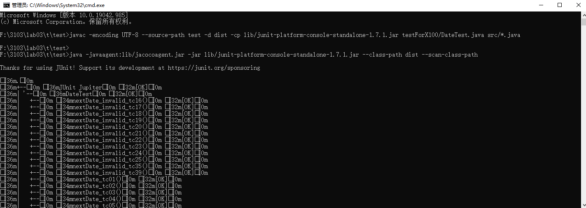
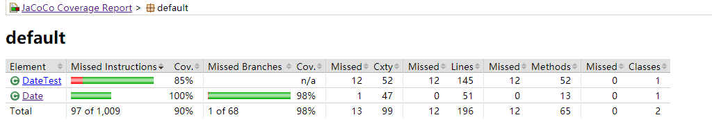
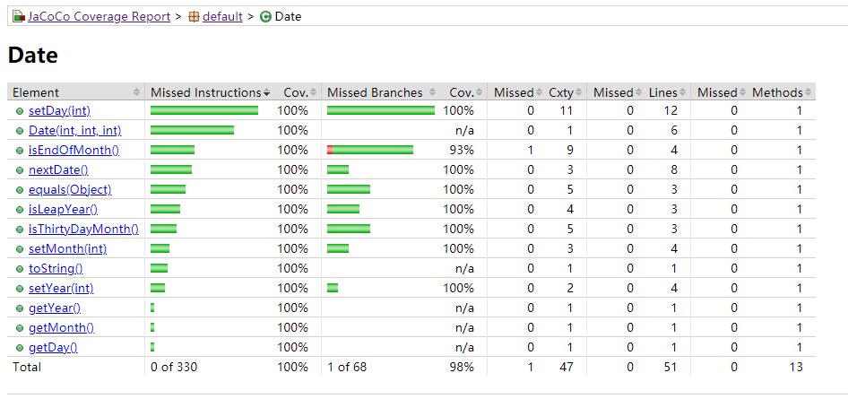

# SEG3103

| Outline | Value |
| --- | --- |
| Course | SEG 3103 |
| Date | Summer 2021 |
| Professor | Andrew Forward, aforward@uottawa.ca |
| TA | n.bayati, n.bayati@uottawa.ca |
| Team | Chuhao jia 8794959<br>Keng Li 7847075 |


## Deliverables

* [https://github.com/jiachuhao123/seg3103_playground/tree/main/lab03](https://github.com/jiachuhao123/seg3103_playground/tree/main/lab02)
* Shared repo above with TA and Professors

### System

Windows 10

### Java

I am running Java openjdk 16

```bash
java --version
java 16.0.1 2021-04-20
Java(TM) SE Runtime Environment (build 16.0.1+9-24)
Java HotSpot(TM) 64-Bit Server VM (build 16.0.1+9-24, mixed mode, sharing)
```


### Exercise

To run the test with 100% coverage for class Date, u need run "DateTest.java" in testForX100.
run the follwing command in Date folder

Complier 
```bash
javac -encoding UTF-8 --source-path test -d dist -cp lib/junit-platform-console-standalone-1.7.1.jar testForX100/DateTest.java src/*.java

java -javaagent:lib/jacocoagent.jar -jar lib/junit-platform-console-standalone-1.7.1.jar --class-path dist --scan-class-path

java -jar lib/jacococli.jar report jacoco.exec --classfiles dist --sourcefiles src --html report
```


It will create a report folder, enter this folder and find index.html. You will then get this page.



You can see we get 100% coverage for Date class



But we have a Missed Branches here.


The missing one is when month = 2, day = 29 and this year is not leap year. But we cannot have this branch beacuse if we create a date with like 2001-2-29, then before we run isEndOfMonth() function in nextDate() function. It will cause an exception in setDay() function, so we will never cover this branch.


