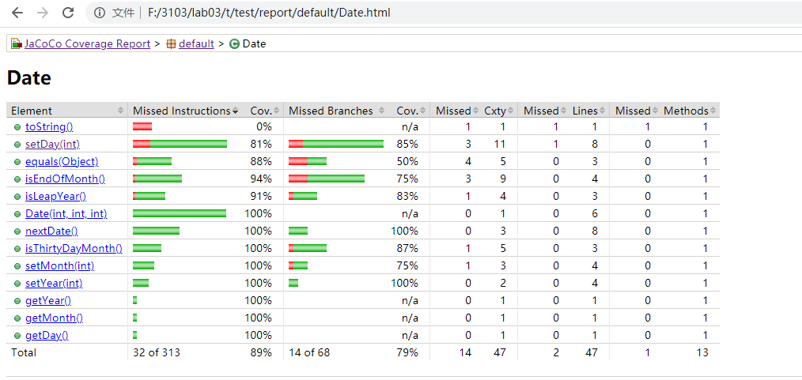

# SEG3103

| Outline | Value |
| --- | --- |
| Course | SEG 3103 |
| Date | Summer 2021 |
| Professor | Andrew Forward, aforward@uottawa.ca |
| TA | n.bayati, n.bayati@uottawa.ca |
| Team | Chuhao jia 8794959<br>Keng Li 7847075 |


## Deliverables

* [https://github.com/jiachuhao123/seg3103_playground/tree/main/lab03](https://github.com/jiachuhao123/seg3103_playground/tree/main/lab02)
* Shared repo above with TA and Professors

### System

Windows 10

### Java

I am running Java openjdk 16

```bash
java --version
java 16.0.1 2021-04-20
Java(TM) SE Runtime Environment (build 16.0.1+9-24)
Java HotSpot(TM) 64-Bit Server VM (build 16.0.1+9-24, mixed mode, sharing)
```


### Exercise for 100% COVERAGE by adding test

To run the test with 100% coverage for class Date, u need run "DateTest.java" in testForX100.
run the follwing command in Date folder

Complier 
```bash
javac -encoding UTF-8 --source-path test -d dist -cp lib/junit-platform-console-standalone-1.7.1.jar testForX100/DateTest.java src/*.java

java -javaagent:lib/jacocoagent.jar -jar lib/junit-platform-console-standalone-1.7.1.jar --class-path dist --scan-class-path

java -jar lib/jacococli.jar report jacoco.exec --classfiles dist --sourcefiles src --html report
```


It will create a report folder, enter this folder and find index.html. You will then get this page.


You can see we get 100% coverage for Date class. To make it 100%, I just try all the possibility for Date class. It means, let our test to make every line of code in the program work, and let the test include all possible situations. For example, in the following pic, if the program run isEndOfMonth(). Then I need to first have two test that one for leaf year and one for not leaf year. Then I need a test for day = 31 and day for not 31 etc.


But we have a Missed Branches here.


The missing one is when month = 2, day = 29 and this year is not leap year. But we cannot have this branch beacuse if we create a date with like 2001-2-29, then before we run isEndOfMonth() function in nextDate() function. It will cause an exception in setDay() function, so we will never cover this branch.

### Exercise for REFACTOR

We first run the original Date.java and test.java.
```bash
javac -encoding UTF-8 --source-path test -d dist -cp lib/junit-platform-console-standalone-1.7.1.jar test/DateTest.java src/*.java

java -javaagent:lib/jacocoagent.jar -jar lib/junit-platform-console-standalone-1.7.1.jar --class-path dist --scan-class-path

java -jar lib/jacococli.jar report jacoco.exec --classfiles dist --sourcefiles src --html report
```
We check the coverage of it.

We see it has 85% coverage, and 64% for setDay. Then we make some small change of this function.

The original:

After change


We then run the Date.java and test.java after changing.
```bash
javac -encoding UTF-8 --source-path test -d dist -cp lib/junit-platform-console-standalone-1.7.1.jar test/DateTest.java rsrc/*.java

java -javaagent:lib/jacocoagent.jar -jar lib/junit-platform-console-standalone-1.7.1.jar --class-path dist --scan-class-path

java -jar lib/jacococli.jar report jacoco.exec --classfiles dist --sourcefiles src --html report
```

We check the coverage of it.

We see it has 89% coverage, and 81% for setDay. Then we make some small change of this function.

Therefore, the coverage improve after we change the code. Because I merged two separate if statements with an or statement, so when the program is running, whenever one of the if statements is triggered, both if statements are considered to have been called, through the or statement
