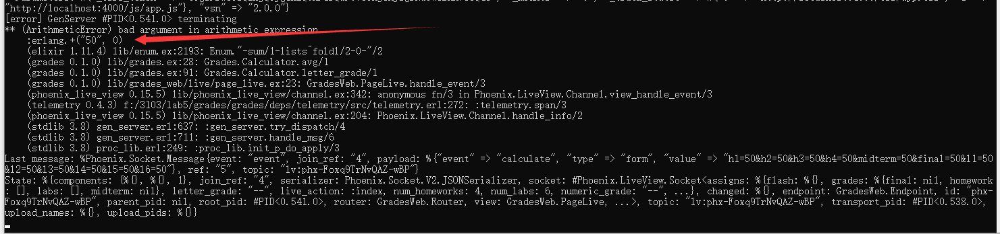
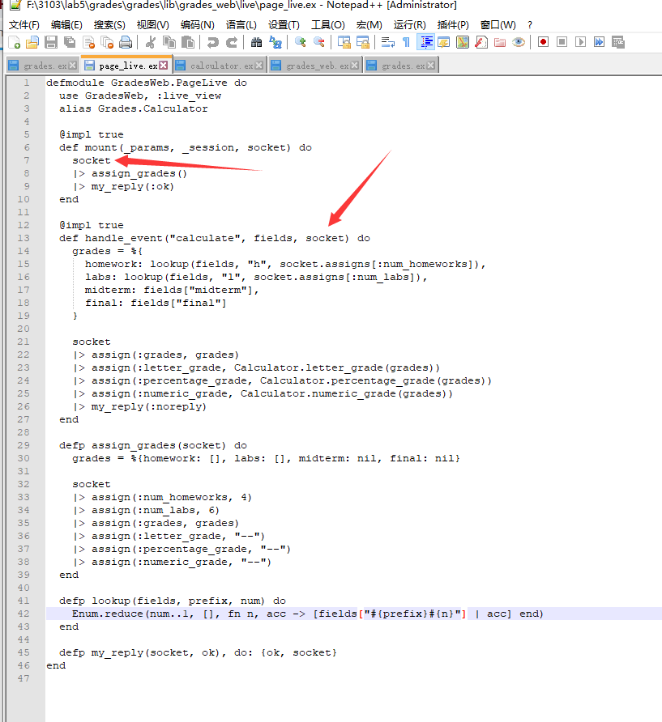

# SEG3103

| Outline | Value |
| --- | --- |
| Course | SEG 3103 |
| Date | Summer 2021 |
| Professor | Andrew Forward, aforward@uottawa.ca |
| TA | Henry Chen, zchen229@uottawa.ca |
| Team | Chuhao jia 8794959 Keng Li 7847075 |

## Deliverables

* [https://github.com/jiachuhao123/seg3103_playground/tree/main/lab05](https://github.com/jiachuhao123/seg3103_playground/tree/main/lab05)
* Shared repo above with TA and Professors

### System

Windows 10

### Stub
add code in grade.ex. By checking page_live.ex. We know we have to change the module name to Grades.Calculator to link to the calculator event in the page. We just want each click generate a random grade set.

After coding, we check if it works.

Looks good.

Then we replace the code to what we did in assignment 2. But there is an error.

We found that there is a "bad argument in arithmetic expression" problem.
We check the page_live.ex and grade.ex again.

We found that for each input, the type is a tuple, not an integer. So the function avg cannot work. Therefore, we have to change the type of the grade to integer when we start to calculate the grade. ( I know how to do this in java but I didn't find a detailed tutorials for exlixir, so I just mention the reason of the error here).
