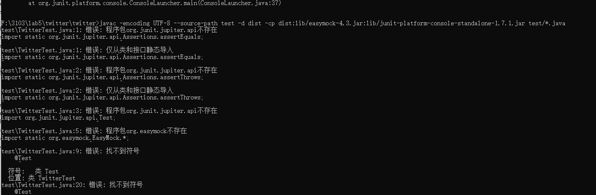
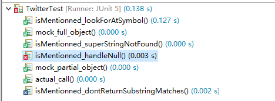
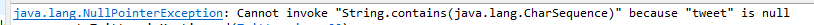
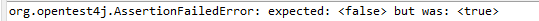
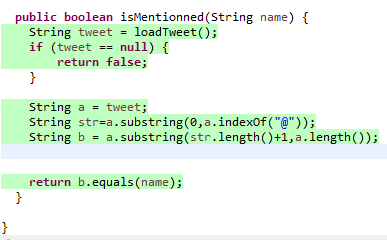
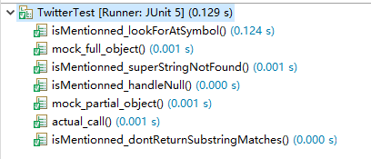

# SEG3103

| Outline | Value |
| --- | --- |
| Course | SEG 3103 |
| Date | Summer 2021 |
| Professor | Andrew Forward, aforward@uottawa.ca |
| TA | Henry Chen, zchen229@uottawa.ca |
| Team | Chuhao jia 8794959<br>Keng Li 7847075 |


## Deliverables

* [https://github.com/jiachuhao123/seg3103_playground/tree/main/lab05](https://github.com/jiachuhao123/seg3103_playground/tree/main/lab05)
* Shared repo above with TA and Professors

### System

Windows 10

### Before start
run the following code in grade (root)
```bash
mix deps.get
cd assets && npm install
```
Then we can run
```bash
mix phx.server
```
and login http://localhost:4000/ for lab05 part 1.

### Stub

add code in grade.ex. By checking page_live.ex. We know we have to change the module name to Grades.Calculator to link to the calculator event in the page. We just want each click generate a random grade set.


After coding, we check if it works.


Looks good.

Then we replace the code to what we did in assignment 2. But there is an error.

We found that there is a "bad argument in arithmetic expression" problem.
We check the page_live.ex and grade.ex again.

We found that for each input, the type is a tuple, not an integer. So the function avg cannot work. Therefore, we have to change the type of the grade to integer when we start to calculate the grade. ( I know how to do this in java but I didn't find a detailed tutorials for exlixir, so I just mention the reason of the error here).


### Mocks
### The command code in bin is not working(same error like in lab1, but the correct code for lab1 cannot work for this lab since it has two jar), I have searched for a long time and still didn't know how to run junit5 test in cmd with two jar files(junit and mock) in Windows environment, so I just use eclipse to show the result.(I think the code in bin is for linux system?)


We implemented the 4 missing test and see the result without any change in Twitter.java.

We run the test and notice there are 2 error. (actual_call might be failed if the random number is bigger than 0.45.)


The first error is when the random number bigger than 0.9, it return a null value. So the isMentionned function will break down. Therefore, we need to add a if statement for the condition that loadTweet return null value.
Another error is due to the sentence of tweet.contains. Becuase "meat" contains "me", so no matter if the loadTweet return @meat or @me. isMentionned("me") will always be true.
Therefore, we need change the code in Twitter.java so we require the char after "@" should 100% equal to each other.


Run the test.


It works.

