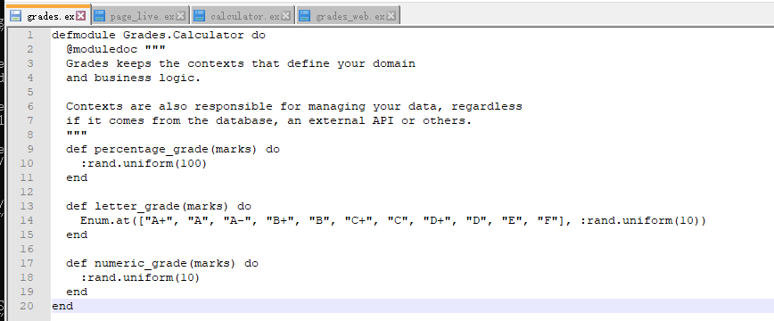
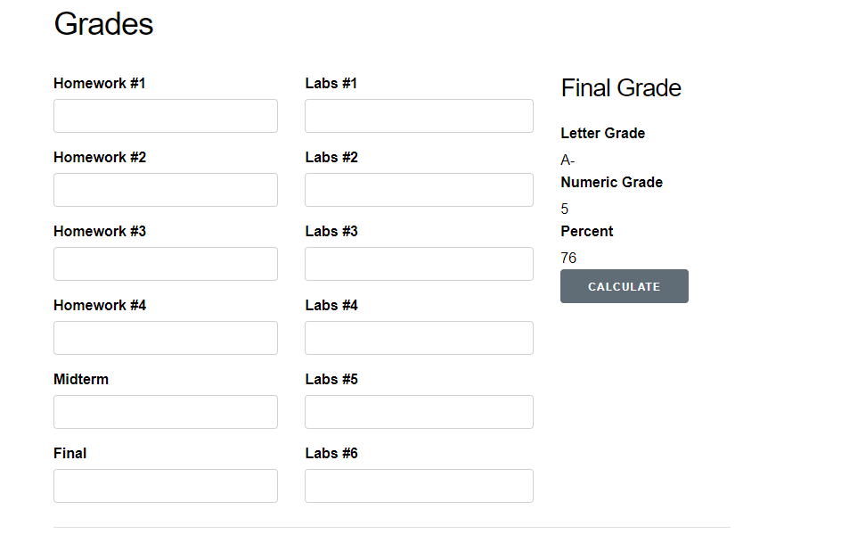

# SEG3103

| Outline | Value |
| --- | --- |
| Course | SEG 3103 |
| Date | Summer 2021 |
| Professor | Andrew Forward, aforward@uottawa.ca |
| TA | Henry Chen, zchen229@uottawa.ca |
| Team | Chuhao jia 8794959 Keng Li 7847075 |

## Deliverables

* [https://github.com/jiachuhao123/seg3103_playground/tree/main/lab05](https://github.com/jiachuhao123/seg3103_playground/tree/main/lab05)
* Shared repo above with TA and Professors

### System

Windows 10

### Stub
add code in grade.ex. By checking page_live.ex. We know we have to change the module name to Grades.Calculator to link to the calculator event in the page. We just want each click generate a random grade set.

After coding, we check if it works.

Looks good.

