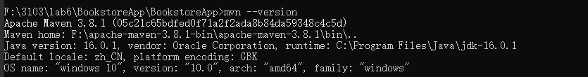
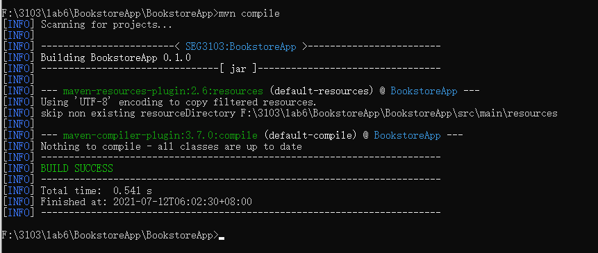
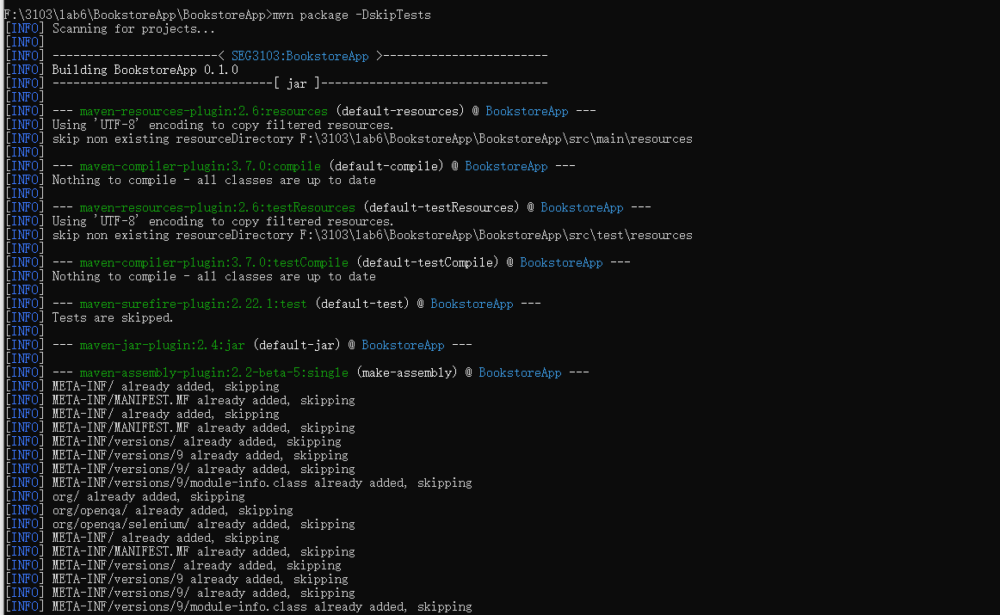
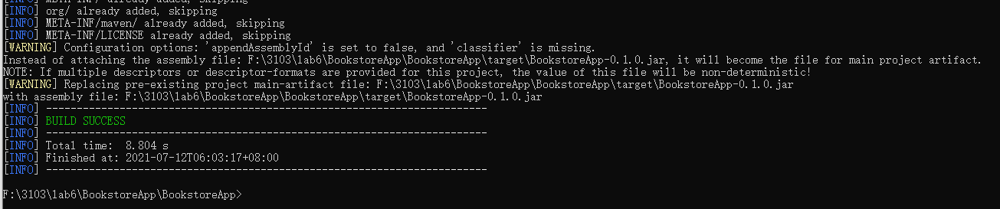
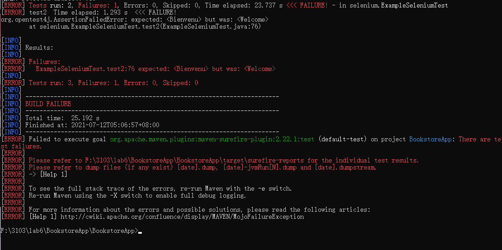
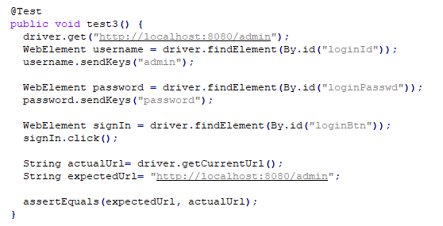
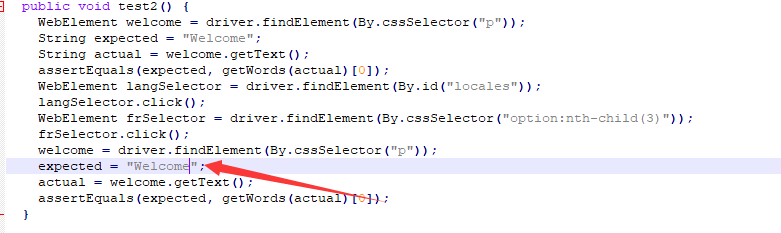
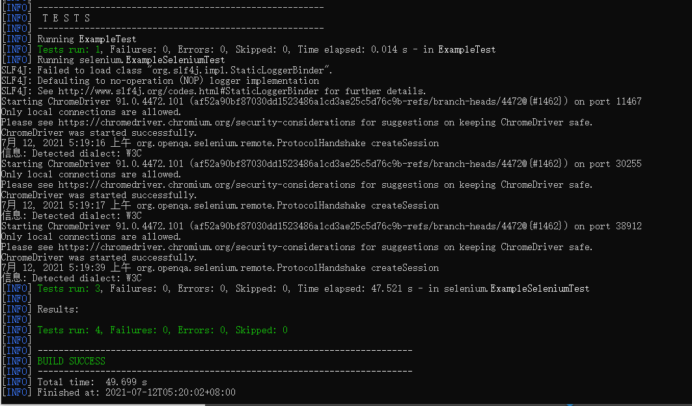

# SEG3103

| Outline | Value |
| --- | --- |
| Course | SEG 3103 |
| Date | Summer 2021 |
| Professor | Andrew Forward, aforward@uottawa.ca |
| TA | Zahra Kakavand, zkaka044@uottawa.ca |
| Team | Chuhao jia 8794959<br>Keng Li 7847075 |


## Deliverables

* [https://github.com/jiachuhao123/seg3103_playground/tree/main/lab06](https://github.com/jiachuhao123/seg3103_playground/tree/main/lab06)
* Shared repo above with TA and Professors

### System

Windows 10

### "mvn --version"
download Maven and install by the instruction on the website. Then run
```bash
mvn --version
```


### "mvn compile"

get into the project, run the command and get the compile result.
```bash
mvn compile
```


### "mvn package -DskipTests"



this command will compile all of the tests but do not running them.


### "java -jar ./target/BookstoreApp-0.1.0.jar"
I cannot login in the http://localhost:8080 by using the given command.
I use
```bash
java -jar bookstore5.jar
```
to start the server.


### "mvn test"
It seems like one test has something wrong, but the command work anyway.


### "mvn test one more"
We add one more test to test if we can login to the right site when we enter the admin for username and the password for password.


BTW, we know there is something wrong with the test2, to make it looks better, we change it.


Here is the result

