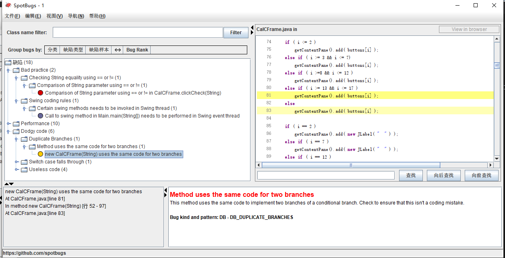

# SEG3103

| Outline | Value |
| --- | --- |
| Course | SEG 3103 |
| Date | Summer 2021 |
| Professor | Andrew Forward, aforward@uottawa.ca |
| TA | zchen, zchen229@uottawa.ca |
| Team | Chuhao jia 8794959<br>Keng Li 7847075 |


## Deliverables

* [https://github.com/jiachuhao123/seg3103_playground/tree/main/lab07](https://github.com/jiachuhao123/seg3103_playground/tree/main/lab07)
* Shared repo above with TA and Professors

### System

Windows 10

## Compile and run

We compiled the program by 
```bash
javac -encoding UTF-8 --source-path test -d dist -cp lib/junit-platform-console-standalone-1.7.1.jar test/*.java src/*.java
```


then run it 
```bash
java -cp ./dist Main
```


Then we run
```bash
java -jar ./lib/spotbugs/lib/spotbugs.jar 
```

to start SpotBugs


We see there are total 18 bugs in the program:


### Bug 1: Comparison of String parameter using == or !=

It says


We just need to change the "==" to the equals method.


### Bug 2: Certain swing methods needs to be invoked in Swing thread

It says


Becuase Swing method is not thread-safe in Java, so when we call show(), setVisible(), and pack(), it might cause some threading issues.

### Bug 3: Could be refactored into a named static inner class


It says


We know CalCFrame class is the outer here. So we can create a new inner class in CalCframe like inner class. Then we can call inner.WindowClose(WindowEvent e) in outer class, of course make it in a static innner class. So we can pass the WindowEvent as argument and don't need to create a new WindowAdapter to make the class to large. 

### Bug 4: Private method is never called
It says


Since the code is never called, and it is not a test at all, so I just delete it.


### Bug 5 and 6: Boxing/unboxing to parse a primitive

The bug 5 and 6 have the same issue


We just need to change the code to XXX.parseXXX method


### Bug 7, 8, 9, 10, 11, 12: Unread field: should this field be static?

All these bug have the same issue


We just need to make them to static value.


### Bug 13: Method uses the same code for two branches

It says


Since all the condition have will lead to the same result, we just need to remove the "else".


Here we delete all the if,else if and else because this bug is linked to bug 15-17.

### Bug 14: Switch statement found where default case is missing

It says


We know it just miss a default statement, so we just need to add one.


### Bug 15-17: Condition has no effect

It says


We know the reason is all the condition has the same result, so the condition has no meaning, we can delete all of them


### Bug 18: Condition has no effect(2)

It says


We just need to delete the code because they did nothing(same result as the previous code)


### Check again
There are only 2 bugs remain. The bug 2 and bug 3, we don't actually know what the code should be like, we just have some idea about the reason and what might be the correct way to debug.


